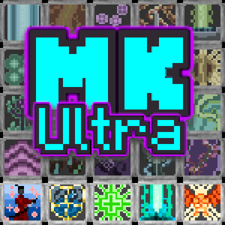

# MineKraft: Ultra

This repository is the home of MineKraft: Ultra, a Classic RPG mod for Minecraft 1.21 and beyond.

>kraft
> <i>Old Saxon</i>
>
>strength, power, force, skill
>
>>"ni sind mi thîne kûðe", quað he;
>> was imu thiu kraft godes,
>>
>>(Heliand, verse 59:4964)

This mod offers a classless progression and other common rpg systems built for Minecraft and inspired by some of our
favorite games. Games like Everquest 1, Warcraft 3, World of Warcraft, Hexen, 
the Elder Scrolls series (especially Daggerfall), a buncha Half-life and Warcraft 3 mods I played as a kid 
that I couldn't possibly remember the names of (shoutout to all you modders throughout the decades!). 

Features:
* Expanded Combat Features:
  * Cooldown Based Ability System
  * A poise system for blocking
  * A weapon overhaul with significant more variety in combat options, two-handed and one-handed weapons, bleed DoTs, weapons that reset their swing time or have increasing swing damage, or bows that draw faster the more times you land a hit in a row.
  * Many (57!) new combat focused attributes such as critical rates, critical damage bonuses, cooldown reduction, magic damage stats, and so on.
* NPC Templating system that allows the creation of custom npc variants via datapack and allows balance changes to be made and propagated to entities already existing in the world.
* An Elder Scrolls-style skill system where your character gradually gets better at the types of actions they are performing
* Progression system that enables the growth of your characters intrinsic strength
* Chat overhaul that includes npc dialogue and mmo-style local, team and global channels.
* Quest System that generates procedural in-world quests as you explore, including dialogue with npcs that have awareness of the world.
* NPC Factions that the player can gain or lose reputation with, affecting how they are reacted to in the world.
* Custom particle system with in-game editor used to power all our ability effects
* Structures with consistent, mmo-style encounter respawning and per-structure-instance randomization to guarantee a consistent, procedural world
* NPC Loot tables that generate per instance placed by a structure so that your dungeons can have consistent, procedural loot.
* Datapack Friendly: Nearly every aspect of the mod can be customized by server owners and sync automatically with players that connect to your server, including all balance decisions!
* Extendable: Our MK Modules have been architected so that other modders can depend upon and extend the functionality as they please.

Our aim is to produce a RPG experience that feels native to Minecraft and produce the tools for others to customize,
iterate, and expand on what we have built.

This repository contains several mods, the content that makes MKU has been split out from the architecture
that makes it possible. Everything has been built with other modders needs in mind
and our content is separate in case you don't like our lore, class ideas, or somewhat humorous approach
to RPG flavor. MKU itself simply consumes the API provided by the MK Modules.

## Module Introduction

MKU is made up of several dependency mods on account of the far reaching nature of our modifications.
We've split these dependencies up for ease of updating and so that people with different use-cases do not
need to depend on the entirety of the MK codebase. A short description of each mod will follow:

### MKUltra

This contains the content, graphics, sounds, particle effects, abilities, npcs,
loot tables, structures, items, and so on that make up the 'visible' part of MKU. 
This is the proverbial tip of the iceberg. If you're curious about what using the MK API would look like
this is where you should start.

Currently Adds:
* 9 Factions
* 7 Quest Templates
* 43 Npc Templates
* 46 Abilities
* 7 Structures
* 14 Loot Tables
* 7 Talent Trees

### MKCore

MKCore is the backbone of the entire MK ecosystem. It contains the ability system, particle system,
and other core parts of the combat overhaul that makes MKU work. Features include:

* A hotbar cooldown based ability system inspired by Warcraft 3 and World of Warcraft, usable by player and non-player characters
* An Elder Scrolls style "improve as you use" skill system 
* A talent system for discrete, intrinsic character progression
* 57 New Combat Focused Attributes
* A system for managing MMORPG style player pets
* UI overhauls to support characters with stats that advance far beyond vanilla Minecraft
* An expanded chance based critical system for spells and melee
* A 'Persona' system that allows players to have more than 1 character on a given server
* A Minecraft and Everquest 1 inspired Particle System and In-Game Particle Editor for producing magic effects
* 8 New Asset Registries:
  * MKAbility : The objects that represent abilities
  * MKDamageType : A significantly more customizable approach to handling damage.
  * MKEffect : An expanded effect system that replaces the use of vanilla effects for most of our abilities
  * MKTalent : The objects that represent character progression options
  * MKEntitlement : A flagging system that allows characters to be marked as having gained certain achievements
  * LocationProviderType: Used to specify how and where effects generate in the world
  * ProjectileCastBehaviorType : Used to specify how projectiles behave for projectile spawning abilities
  * AbilityClientStateType : Used to perform complex ability-specific synchronization between server and client
* Extendable Character Sheet for visualizing your combat stats, skills, slotting abilities, and talents
* Command Support for most new mechanics
* Data Generation Functionality for:
  * Abilities
  * Particle Animations
  * Talent Trees
* An Armor Class system that provides benefits and drawbacks to different types of armor
* Advanced network syncing functionality that allows complex objects, maps, and lists to be efficiently synced
* Data changes like ability balance and talents available are synced to clients from servers
* Expanded Party mechanics built on the team system that will allow you to share combat XP gains as well as see your party/team members health and mana
* Overhaul to blocking: You can now block without a shield, non-shields provide reduced damage prevention. Blocking now also has a poise system that prevents you from blocking forever.

### MKChat

MKChat overhauls the way chat behaves in minecraft to support Everquest 1 style npc dialogue system and a more mmo-style approach to server chat.
By default player speech will now occur in a small radius around the player, npcs will also speak in this channel.

Other features include:
* Overhauls chat to be local and adds a few additional channels
  * /dim will chat with everyone in your current dimension
  * /ooc will chat with everyone on the server
  * /p will chat with everyone in your party/team
* A dialogue tree system that allows modders to create npc dialogues
* Data Generation Functionality for the dialogue tree
* 2 New Asset Registries:
  * DialogueEffectType: Allows custom implementations for the effects of dialogue lines
  * DialogueConditionType: Allows custom implementations for conditions underwhich dialogue lines will be said

### TargetingAPI

Targeting API is a very simple standalone api that allows mods to specify how they desire their 
entities to relate to each other: Friend, Enemy, Neutral or Unhandled. This mod is used by the rest of the
MK Modules to determine entity relations for executing hostile or friendly spells, determining whether mobs will attack the player,
whether the player can talk with the npc, and anything else related to relations. You will mostly never
make use of this mod directly. If you are a mod-maker that has complex relations in your own mod, you can 
depend on this mod to create a shim that will allow the rest of the MK suite to understand your relations without
having to pull in any of our larger dependencies.

### MKWidgets

MKWidgets is a widget based UI framework that predates vanilla Minecraft's own widget overhaul. It integrates seamlessly
with existing Minecraft widgets while providing a much more advanced composable widget system using constraint-based layouting.
With the use of MKWidgets we have managed to migrate our UI from 1.12 all the way through to 1.21 without having to change
the UI code itself. 

The architecture differences were inspired by my many years on the Kivy UI project and usage of Apple's constraint layout system.

### MKFaction

MKFactions provides an Everquest 1 style faction system with integration to Targeting API. This allows players to have
dynamic and persistent relations to groups of npcs. The factions also support some additional data for generating
randomized npcs such as names, battlecrys and such.

Features:
* Player:Npc, Npc:Player, and Npc:Npc Relationship decisions based on dynamic faction data and data configuration
* 1 New Registry: MKFaction, contains individual faction data
* Integration with Targeting API so that faction relations influence targeting decisions.
* Data Generation functionality for generating factions
* Default configurations for vanilla mobs

### MKWeapons

MKWeapons extends functionality for equippable items to make it easier to generate loot, create weapon types, and allow pack creators to balance and configure the items.

Features:
* A Framework for creating new weapon types and exposing balance decisions to datapacks for control by server owners
* 3d Weapon Models provided by longtime MK Collaborator Janivire!
* Introduces a distinction between two-handed and one-handed weapons
* A modular framework for adding features and customization to equippable items
* Weapon damage scales based on weapon skills
* Integration with Curios to provide accessories that make use of the same infrastructure for customizing items
* A loot randomization system designed to create templates for weapons that can then be instantiated and saved in world to provide consistent, randomized loot tables in world
* Data Generation Functionality for:
  * Loot Tiers
  * Weapon Types

Melee Weapons Added and Default Balance Settings:
* Great Sword
  * Damage Multiplier: 2.5x
  * Attack Speed: 1.0
  * Critical +90% Damage, 10% Chance
  * 80% Block Efficiency, 25 Poise
  * Two-Handed
  * Skill: Two Hand Slash
  * Reach +1.0
  * Double Strike: 20% Chance to Reset Swing Cooldown
* Long Sword
  * Damage Multiplier: 1.5x
  * Attack Speed: 1.6
  * Critical +50% Damage, 5% Chance 
  * 75% Block Efficiency, 25 Poise
  * Skill: One Hand Slash
  * Fury Strike: Each successive strike increases damage by 25% up to 5 strikes
* Katana
  * Damage Multiplier: 1.5x
  * Attack Speed: 1.8
  * Critical +100% Damage, 10% Chance
  * 75% Block Efficiency, 25 Poise
  * Two-Handed
  * Skill: Two Hand Slash
  * Combo Strike: Each successive strike reduces swing cooldown by 25% up to 5 strikes and then resets
* Dagger
  * Damage Multiplier: 1.0x
  * Attack Speed: 3.0
  * Critical +150% Damage, 10% Chance
  * 50% Block Efficiency, 20 Poise
  * Reach -1.0
  * Skill: One Hand Pierce
  * Combo Strike: Each successive strike reduces swing cooldown by 50% up to 3 strikes and then resets
  * Bleed : Each strike bleeds the opponent causing 100% of weapon damage over 4 seconds, stacking up to 10 times
* Staff
  * Damage Multiplier: 1.75x
  * Attack Speed: 1.5
  * Critical +50% Damage, 5% Chance
  * 85% Block Efficiency, 30 Poise
  * Two-Handed
  * Reach +1.0
  * Skill: Two Hand Blunt
  * Combo Strike: Each successive strike reduces swing cooldown by 15% up to 5 strikes and then resets
  * Stun : Each strike has a 20% chance to stun the target for 2 seconds
* Spear
  * Damage Multiplier: 2.0x
  * Attack Speed: 2.0
  * Critical +75% Damage, 5% Chance
  * 75% Block Efficiency, 30 Poise
  * Reach +2.0
  * Two-Handed
  * Skill: Two Hand Pierce
  * Fury Strike: Each successive strike increases damage by 40% up to 3 strikes
  * Bleed : Each strike bleeds the opponent causing 75% of weapon damage over 5 seconds, stacking up to 5 times
* Warhammer
  * Damage Multiplier: 2.25x
  * Attack Speed: 1.25
  * Critical +25% Damage, 5% Chance
  * 80% Block Efficiency, 25 Poise
  * Reach +1.0
  * Two-Handed
  * Skill: Two Hand Blunt
  * Stun : Each strike has a 10% chance to stun the target for 5 seconds
  * Undead Damage : Deals 200% damage to undead
* Battleaxe
  * Damage Multiplier: 2.25x
  * Attack Speed: 0.8
  * Critical +75% Damage, 5% Chance
  * 80% Block Efficiency, 25 Poise
  * Reach +2.0
  * Two-Handed
  * Skill: Two Hand Slash
  * Bleed : Each strike bleeds the opponent causing 100% of weapon damage over 4 seconds, stacking up to 2 times
* Mace
  * Damage Multiplier: 1.75x
  * Attack Speed: 1.9
  * Critical +25% Damage, 5% Chance
  * 75% Block Efficiency, 30 Poise
  * Skill: One Hand Blunt
  * Double Strike: 10% Chance to Reset Swing Cooldown
  * Undead Damage : Deals 150% damage to undead

Ranged Weapons:
* Longbow
  * Draw Time: 2.5 Seconds
  * Launch Velocity: 4.0
  * Attack damage bonus from bow material is added to arrow damage
  * Rapid Fire: Each successful shot that hits a target reduces draw time by 10% up to 7 times
  
 ### MKNpc

MKNpc contains the NPC focused extensions of the MK System. This includes AI that allows npc to use the
MKAbilities that players use, a mmo-style spawner block, and an NPC definition system that allows datapack templating
of npcs from entity types. 

Features:
* NpcDefinition templating system for NPCs, develop npc variants from any Minecraft mob, easily adjust balance and see it reflected in your world.
* MKQuest System : Create In World, Per-Structure-Instance Quests with dialogue and procedural rewards.
* MKSpawner : MMO-style spawn point that ensures consistent, respawning encounters for your structures
* Advanced Structures that can come alive when players enter, responding to player actions
* Two New Asset Registries:
  * NpcOptionTypes : Registers configuration options for the NPC Definition system
  * NpcOptionEntryTypes : Registers persistent world storage for configuration options that contain per-instance generation data.
* One New Data Registry:
  * NpcDefinitions : Templates for creating NPC variants on an entity type.